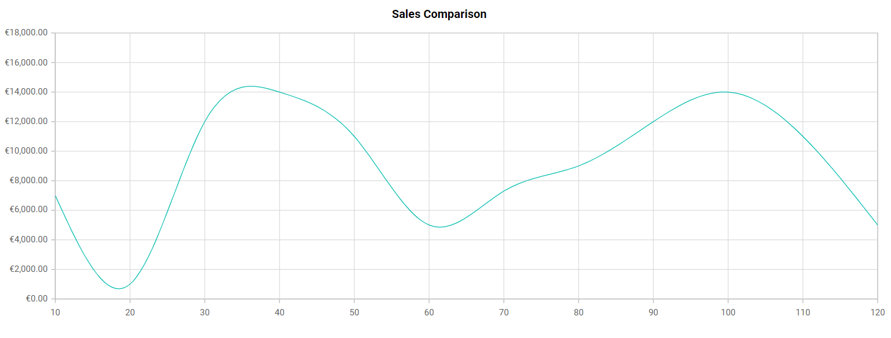

# How-to-customize-the-axis-label-format-based-on-the-culture-in-Blazor-charts

This article explains how to format axis label based on culture in Blazor Chart Component.

**Format axis label based on culture in Blazor chart**

[Blazor Chart](https://www.syncfusion.com/blazor-components/blazor-charts) allows you to change the axis label format using [LabelFormat](https://help.syncfusion.com/cr/blazor/Syncfusion.Blazor.Charts.ChartAxis.html#Syncfusion_Blazor_Charts_ChartAxis_LabelFormat) property in chart axis. 

To set the desired culture in the program.cs file, use the following code. In this example, I have used the "en-IE" culture to display the "Euro" currency symbol.  

```cshtml
app.UseRequestLocalization("en-IE"); // for Euro
```

The following code example demonstrates how to format axis label to currency by using [LabelFormat](https://help.syncfusion.com/cr/blazor/Syncfusion.Blazor.Charts.ChartAxis.html#Syncfusion_Blazor_Charts_ChartAxis_LabelFormat) property.

**Index.razor**

```cshtml

@using Syncfusion.Blazor.Charts

<SfChart Title="Sales Comparison">

    <ChartPrimaryYAxis LabelFormat="c" Minimum="0"/>

    <ChartSeriesCollection>
        <ChartSeries DataSource="@Data" XName="X" YName="Y" Type="ChartSeriesType.Spline"/>
    </ChartSeriesCollection>

</SfChart>

@code {

    public class ChartData
    {
        public double X { get; set; }
        public double Y { get; set; }
    }

    public List<ChartData> Data = new List<ChartData>
    {
        new ChartData{ X= 10, Y=7000 },
        new ChartData{ X= 20, Y= 1000 },
        new ChartData{ X= 30, Y= 12000 },
        new ChartData{ X= 40, Y= 14000 },
        new ChartData{ X= 50, Y= 11000 },
        new ChartData{ X= 60, Y= 5000 },
        new ChartData{ X= 70, Y= 7300 },
        new ChartData{ X= 80, Y= 9000 },
        new ChartData{ X= 90, Y= 12000 },
        new ChartData{ X= 100, Y= 14000 },
        new ChartData{ X= 110, Y= 11000 },
        new ChartData{ X= 120, Y= 5000 }
    };
}

```

The following screenshot illustrates the output of the above code snippet.

**Output:**



**Conclusion**

I hope you enjoyed learning how to customize axis label format based on culture in Blazor Chart Component.

You can refer to our [Blazor Chart feature tour](https://www.syncfusion.com/blazor-components/blazor-charts) page to know about its other groundbreaking feature representations and [documentation](https://blazor.syncfusion.com/documentation/chart/getting-started), and how to quickly get started for configuration specifications. You can also explore our [Blazor Chart example](https://blazor.syncfusion.com/demos/chart/line?theme=bootstrap5) to understand how to create and manipulate data.

For current customers, you can check out our components from the [License and Downloads](https://www.syncfusion.com/sales/teamlicense) page. If you are new to Syncfusion, you can try our 30-day [free trial](https://www.syncfusion.com/downloads/blazor) to check out our other controls.

If you have any queries or require clarifications, please let us know in the comments section below. You can also contact us through our [support forums](https://www.syncfusion.com/forums), [support portal](https://support.syncfusion.com/create), or [feedback portal](https://www.syncfusion.com/feedback/blazor-components?control=charts). We are always happy to assist you!
